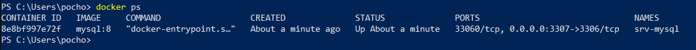

# Variables de Entorno
### ¿Qué son las variables de entorno

Variables de entorno: Es información que ocupa el sistema operativo para funcionar de forma adecuada, como direcciones con información que puede ser útil para el correcto funcionamiento del sistema. Cada sistema tiene su forma de gestionar estas variables de entorno y sirven para mantener configuraciones o información de forma personalizada, siendo posible la automatización de algunas tareas.

# COMPLETAR

### Para crear un contenedor con variables de entorno?

```
docker run -d --name <nombre contenedor> -e <nombre variable1>=<valor1> -e <nombre variable2>=<valor2>
```


### Crear un contenedor a partir de la imagen de nginx:alpine con las siguientes variables de entorno: username y role. Para la variable de entorno rol asignar el valor admin.

# COMPLETAR


# CAPTURA CON LA COMPROBACIÓN DE LA CREACIÓN DE LAS VARIABLES DE ENTORNO DEL CONTENEDOR ANTERIOR


### Crear un contenedor con mysql:8 , mapear todos los puertos
# COMPLETAR

### ¿El contenedor se está ejecutando?

No, el contenedor no se ejecutó y no aparecieron los puertos que se le asignaron, al ver los archivos a través del log, se muestra que es necesario establecer las variables de entorno adecuadas para el usuario y la contraseña. 
No existen bases de datos dentro del contenedor, no obstante, al funcionar con comandos de mysql se pudo crear una base de datos dentro del contenedor. 

# COMPLETAR

### Identificar el problema
# COMPLETAR



### Eliminar el contenedor creado con mysql:8 
# COMPLETAR

### Para crear un contenedor con variables de entorno especificadas
- Portabilidad: Las aplicaciones se vuelven más portátiles y pueden ser desplegadas en diferentes entornos (desarrollo, pruebas, producción) simplemente cambiando el archivo de variables de entorno.
- Centralización: Todas las configuraciones importantes se centralizan en un solo lugar, lo que facilita la gestión y auditoría de las configuraciones.
- Consistencia: Asegura que todos los miembros del equipo de desarrollo o los entornos de despliegue utilicen las mismas configuraciones.
- Evitar Exposición en el Código: Mantener variables sensibles como contraseñas, claves API, y tokens fuera del código fuente reduce el riesgo de exposición accidental a través del control de versiones.
- Control de Acceso: Los archivos de variables de entorno pueden ser gestionados con permisos específicos, limitando quién puede ver o modificar la configuración sensible.

Previo a esto es necesario crear el archivo y colocar las variables en un archivo, **.env** se ha convertido en una convención estándar, pero también es posible usar cualquier extensión como **.txt**.
```
docker run -d --name <nombre contenedor> --env-file=<nombreArchivo>.<extensión> <nombre imagen>
```
**Considerar**
Es necesario especificar la ruta absoluta del archivo si este se encuentra en una ubicación diferente a la que estás ejecutando el comando docker run.

### Crear un contenedor con mysql:8 , mapear todos los puertos y configurar las variables de entorno mediante un archivo
# COMPLETAR


# CAPTURA CON LA COMPROBACIÓN DE LA CREACIÓN DE LAS VARIABLES DE ENTORNO DEL CONTENEDOR ANTERIOR 

### ¿Qué bases de datos existen en el contenedor creado?

Como tal solo se creó el contenedor, por lo que solamente tenemos el servidor sin una base de datos dentro de él

# COMPLETAR
